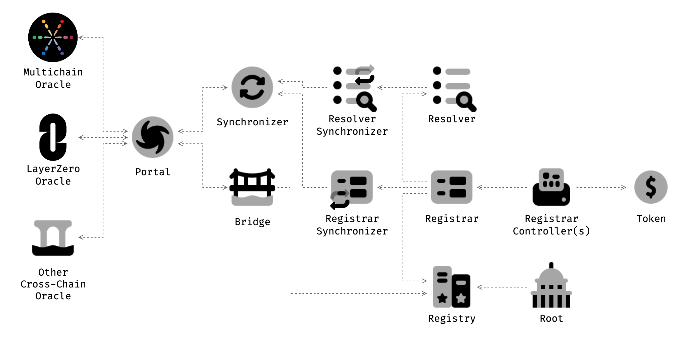
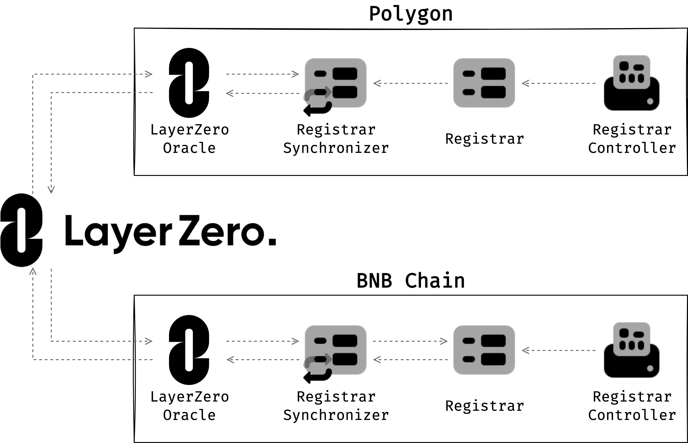

# EDNS - Omni



## Synchronizer



### Naming Convention

- `constant` or `immutable` state must be upper snack case
- Private state name must be start with `_`
- Getter function name must be start with `get`
- Getter function name with `bool` type must be start with `is`
- Setter function name must be start with `set`
- `modifier` name must be start with `only`
- `event` name must be used with `${Action/Event}{Entity}` pattern


### Test
```
npx hardhat test
```
